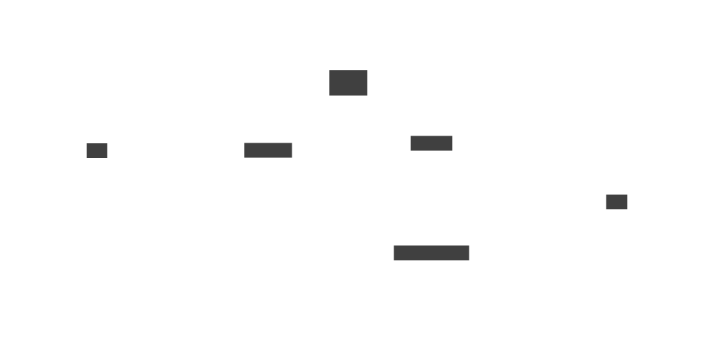

# What is `vesti` language?

LaTeX is a popular typescripting language around the world. In particular, when
one is writting a document with many mathematical equations, then LaTeX is the
good choice. I personally, write every documents with LaTeX, and I love it.
However, LaTeX has some drawbacks. The critical one which I think is that it
uses `\begin{...}` and `\end{...}` pair to open and close an environment,
respectively. This kind of grammar is quite tetious if there is no snippet, or
autocompletion features.

Here is a simple example of LaTeX document code:

```latex
\documentclass[twocolumn]{article}

\usepackage{amsmath}
\usepackage{amsthm}
\usepackage{amssymb}
\usepackage{array}
\usepackage{tikz}

\begin{document}
This is a plain \LaTeX\ document.
\begin{center}
    \begin{minipage}{0.4\textwidth}
        The minipage makes a box with width 0.4 textwidth.
    \end{minipage}
    \hskip 1pc
    \begin{minipage}{0.4\textwidth}
        The minipage makes a box with width 0.4 textwidth.
    \end{minipage}
\end{center}

\end{document}
```
The purpose of `vesti` typescripting language is somewhat _replacement_ of
LaTeX. Below `vesti` code makes a same pdf as the above LaTeX code generated.

```
docclass article (twocolumn)

importpkg {
    amsmath,
    amsthm,
    amssymb,
    array,
    tikz,
}

startdoc

This is a plain \LaTeX\ document.
useenv center {
    useenv minipage (0.4\textwidth) {
        The minipage makes a box with width 0.4 textwidth.
    }
    \hskip 1pc
    useenv minipage (0.4\textwidth) {
        The minipage makes a box with width 0.4 textwidth.
    }
}
```

Here is the simple diagram how `vesti` works:

